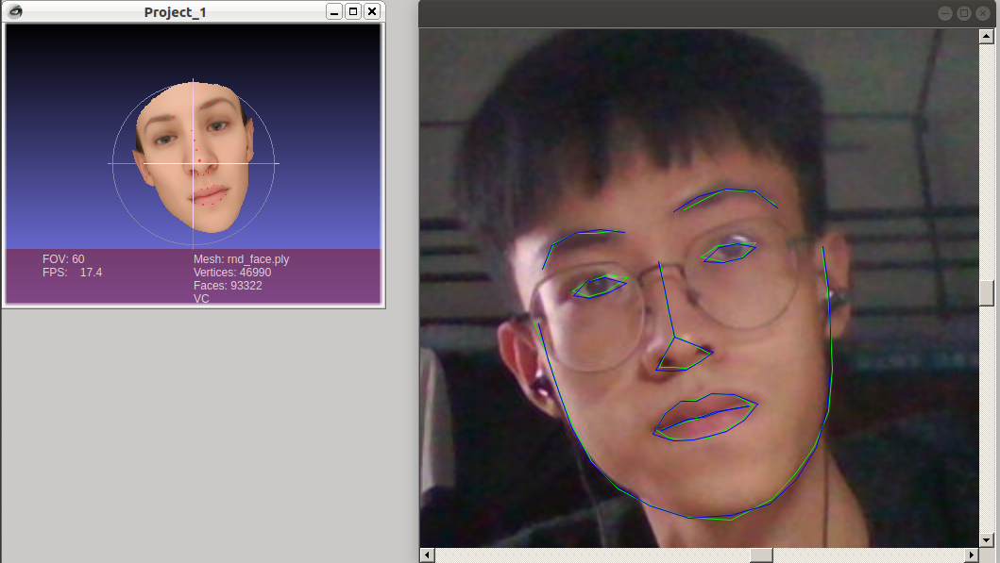

# 头部姿态估计 - C++

使用 [dlib](<https://github.com/davisking/dlib>) 和 [Ceres](<https://github.com/ceres-solver/ceres-solver>) 进行人脸特征点拟合，从而得到头部姿态的各个参数（**yaw**, **pitch**, **roll**, tx, ty, tz）。

## 内容

hpe_webcam.cpp - 使用Ceres中的自动差分和dlib，用电脑自带摄像头或本地视频进行实时拟合；

hpe_oneshot.cpp - 使用Ceres中的自动差分和dlib，读取单张照片进行拟合；

inputs.txt - 格式参见<https://github.com/Great-Keith/BFM-tools>

## 测试

## 编译

修改CMakeLists.txt中的各个依赖包路径，使用CMake进行编译。

*[NOTE] 需要使用`Release`版本，以及增加选项`USE_AVX_INSTRUCTIONS`和`USE_SSE2_INSTRUCTIONS`/`USE_SSE4_INSTRUCTIONS`，否则因为dlib的检测耗时较长，使用`landmark-fitting-cam`会有卡顿。*